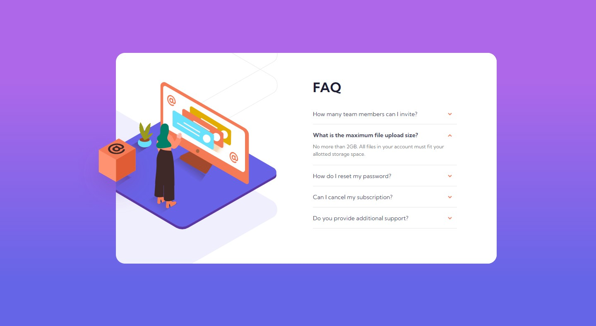

# Frontend Mentor - FAQ accordion card solution

This is a solution to the [FAQ accordion card challenge on Frontend Mentor](https://www.frontendmentor.io/challenges/faq-accordion-card-XlyjD0Oam).

## Table of contents

- [Overview](#overview)
  - [The challenge](#the-challenge)
  - [Screenshot](#screenshot)
  - [Links](#links)
- [My process](#my-process)
  - [Built with](#built-with)
- [Author](#author)

## Overview

### The challenge

Users should be able to:

- View the optimal layout for the component depending on their device's screen size
- See hover states for all interactive elements on the page
- Hide/Show the answer to a question when the question is clicked

### Screenshot

### Links

- Solution URL: [GitHub](https://vace328.github.io/FM-faq-accordion-card/)
- Live Site URL: [Demo](https://your-live-site-url.com)

## My process

### Built with

- Semantic HTML5 markup
- Vanilla JS
- Flexbox

## Author

- Frontend Mentor - [Ana Z.](https://www.frontendmentor.io/profile/vace328)
